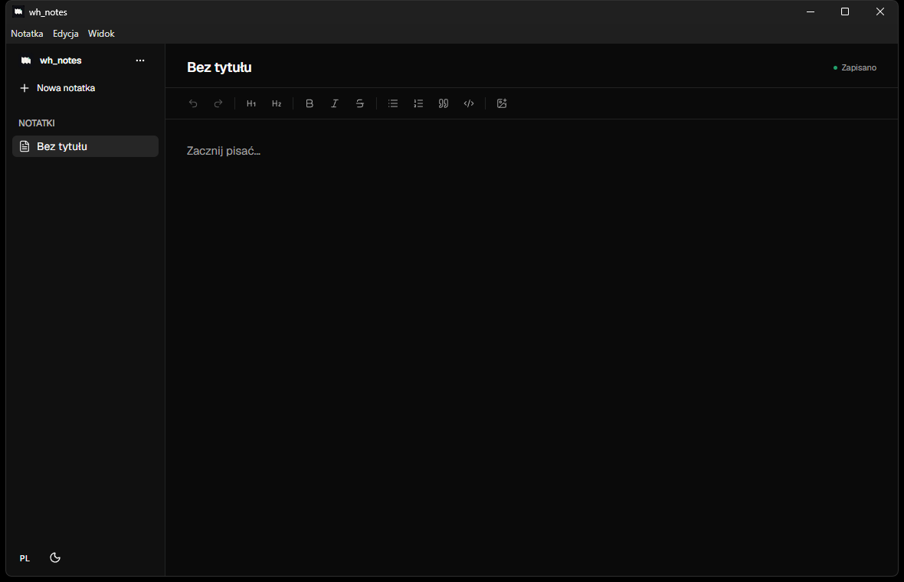

<p align="center">
  
</p>

<h1 align="center">wh_notes</h1>

<p align="center">
  <strong>Private notes. One device. No cloud.</strong>
</p>

<p align="center">
  <a href="https://github.com/whoyoux/wh_notes/actions/workflows/nightly.yml"></a>
  
  
  
</p>

<p align="center">
  <a href="https://github.com/whoyoux/wh_notes/releases"><strong>Download nightly builds</strong></a>
  &middot;
  <a href="#features">Features</a>
  &middot;
  <a href="docs/keyboard-shortcuts.md">Keyboard shortcuts</a>
  &middot;
  <a href="#install">Install</a>
  &middot;
  <a href="#privacy">Privacy</a>
</p>

---



## A quiet place for your notes

wh_notes is a minimalist desktop app for people who want their notes to stay on their own computer. It has no account, no cloud sync, no telemetry, and no hidden online dependency at runtime.

The interface is intentionally small and native-feeling: a focused notes sidebar, a readable editor width, and the tools you need without visual noise.

## Features

- **Offline by design** &mdash; notes, preferences, images, and encrypted archives stay on your device.
- **Rich-text editor** &mdash; headings, lists, quotes, inline code, code blocks with syntax highlighting, and keyboard-friendly editing.
- **Reliable local saving** &mdash; the editor clearly shows when a change is saving, saved on this device, or could not be written.
- **Tested local storage** &mdash; the SQLite repository is covered by automated tests for note creation, saving, ordering, deletion, and local preferences.
- **Command palette and local search** &mdash; press <kbd>Ctrl</kbd>/<kbd>⌘</kbd> + <kbd>K</kbd> to search note titles and text through a local SQLite FTS5 index or run a key action; Trash is never included.
- **Trash with recovery** &mdash; deleted notes stay on this device in Trash for 30 days, where they can be restored or permanently deleted.
- **Pinned notes** &mdash; keep important notes at the top of the active list with a small, local pin.
- **Local sorting** &mdash; order notes by edit time, creation time, or title; the choice stays on your device.
- **Local tags and filters** &mdash; group active notes with private tags without adding folders or sending metadata anywhere.
- **Keyboard shortcuts** &mdash; familiar shortcuts for creating, searching, saving, exporting, and formatting notes; the complete reference is in [Keyboard shortcuts](docs/keyboard-shortcuts.md).
- **Local image handling** &mdash; paste or drag images into a note; wh_notes copies them into its own storage so the original file can be moved or deleted safely.
- **Portable encrypted archives** &mdash; export one note or your complete library into an encrypted archive, then import it on another computer.
- **Light and dark themes** &mdash; powered by shadcn/ui, with the choice stored locally.
- **English and Polish** &mdash; switch the interface language at any time.
- **Compact desktop interface** &mdash; small, consistent controls, menus, and sidebar labels keep the workspace quiet and readable.
- **No lock-in** &mdash; your data is local, and backup/export is built in from the start.

## Install

Nightly builds are created automatically from every change merged into `main`. They are useful for trying the newest version before the first signed stable release.

> Nightly installers are not signed with an Apple Developer certificate or notarized. Windows may show a SmartScreen warning and macOS may show a Gatekeeper warning. Download only from this repository's [Releases](https://github.com/whoyoux/wh_notes/releases) page and verify the included SHA-256 checksum.

| Platform            | Download       | Install                                      |
| ------------------- | -------------- | -------------------------------------------- |
| Windows x64         | `wh_notes.msi` | Run the standard MSI installer.              |
| macOS Intel         | `*-x64.dmg`    | Open it and drag `wh_notes` to Applications. |
| macOS Apple Silicon | `*-arm64.dmg`  | Open it and drag `wh_notes` to Applications. |
| Debian / Ubuntu x64 | `.deb`         | `sudo apt install ./wh-notes_*.deb`          |
| Fedora / RHEL x64   | `.rpm`         | `sudo dnf install ./wh-notes-*.rpm`          |

### Verify a download

Every release includes `SHA256SUMS.txt`.

```powershell
Get-FileHash .\wh_notes.msi -Algorithm SHA256
```

Compare the reported value with the matching entry in `SHA256SUMS.txt` before opening the installer.

## Privacy

wh_notes does not require a login and does not send note content to a cloud service. The app operates offline; GitHub Releases are only a place to manually download installers. Notes in Trash remain local for 30 days; a permanent delete cannot be undone.

## Development

The packaging toolchain uses Node.js 24.

```powershell
npm ci
npm run typecheck
npm test
npm start
```

Build an installer for the current system with:

```powershell
npm run make
```

## Releases

- **Nightly:** automatic prerelease on every push to `main`, with a unique build version.
- **Stable:** versioned release from a `vX.Y.Z` tag, enabled after Windows code signing is configured.

## License

wh_notes is proprietary software. Official installers may be downloaded and used; the source code may not be copied, modified, reverse engineered, or redistributed without written permission. See [LICENSE](LICENSE).
